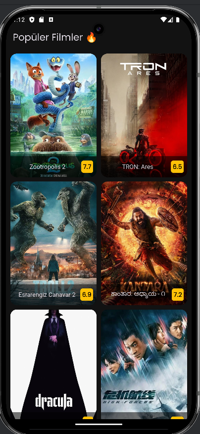
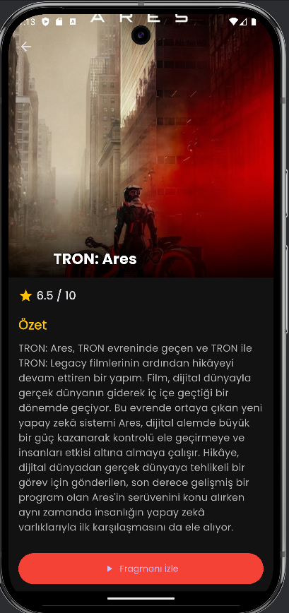

# 🎬 CineMates - Film Keşif Uygulaması

Flutter ile geliştirilmiş, **TMDB (The Movie Database)** API'sini kullanarak anlık popüler filmleri listeleyen ve detaylarını gösteren mobil uygulama.

Bu proje, **REST API entegrasyonu**, **Asenkron State Yönetimi** ve **Gelişmiş UI (Slivers)** yeteneklerini sergilemek için geliştirilmiştir.

## 📱 Özellikler

* **Canlı Veri:** TMDB API üzerinden güncel film verilerini (Puan, Özet, Afiş) çeker.
* **Gelişmiş Arayüz:** `SliverAppBar` kullanılarak yapılan Parallax efektli detay sayfası.
* **Hata Yönetimi:** İnternet kopması veya sunucu hatalarında kullanıcıyı bilgilendiren hata ekranları.
* **Performans:** `FadeInImage` ve önbellek yönetimi ile akıcı görsel deneyim.
* **Clean Architecture:** Servis, Model ve Provider katmanlarının ayrıldığı temiz kod yapısı.

## 🛠️ Kullanılan Teknolojiler

* **Flutter & Dart**
* **Http Client:** Dio
* **State Management:** Provider
* **UI:** CustomScrollView, Slivers, GridView
* **Fonts:** Google Fonts (Poppins)

| Ana Sayfa (Grid) | Detay Sayfası (Parallax) |

|  |  |

